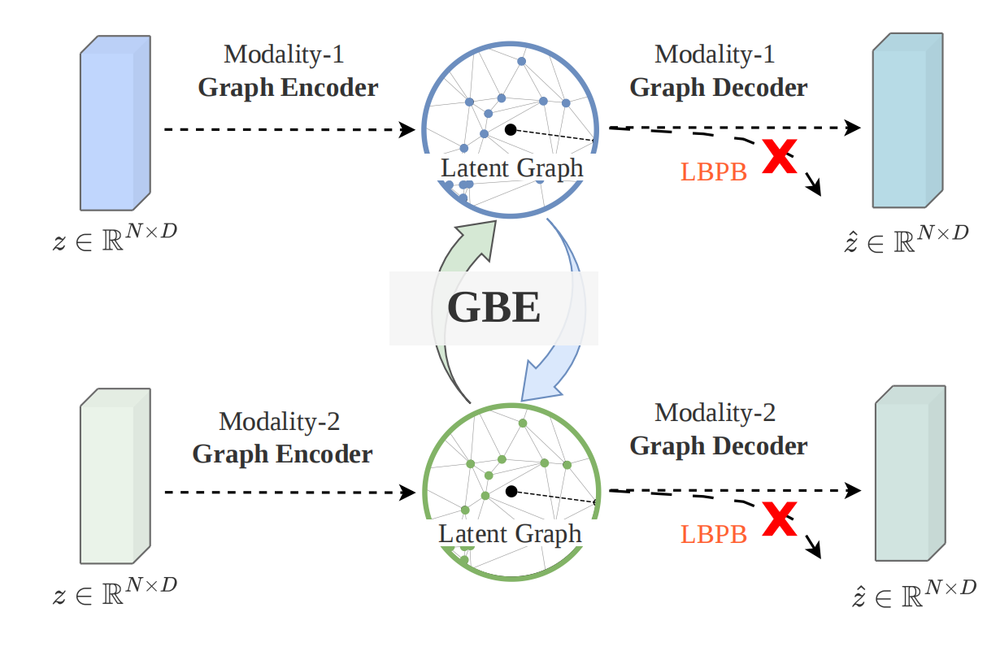
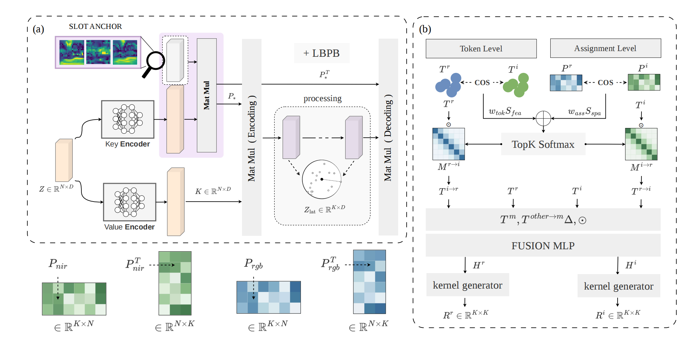
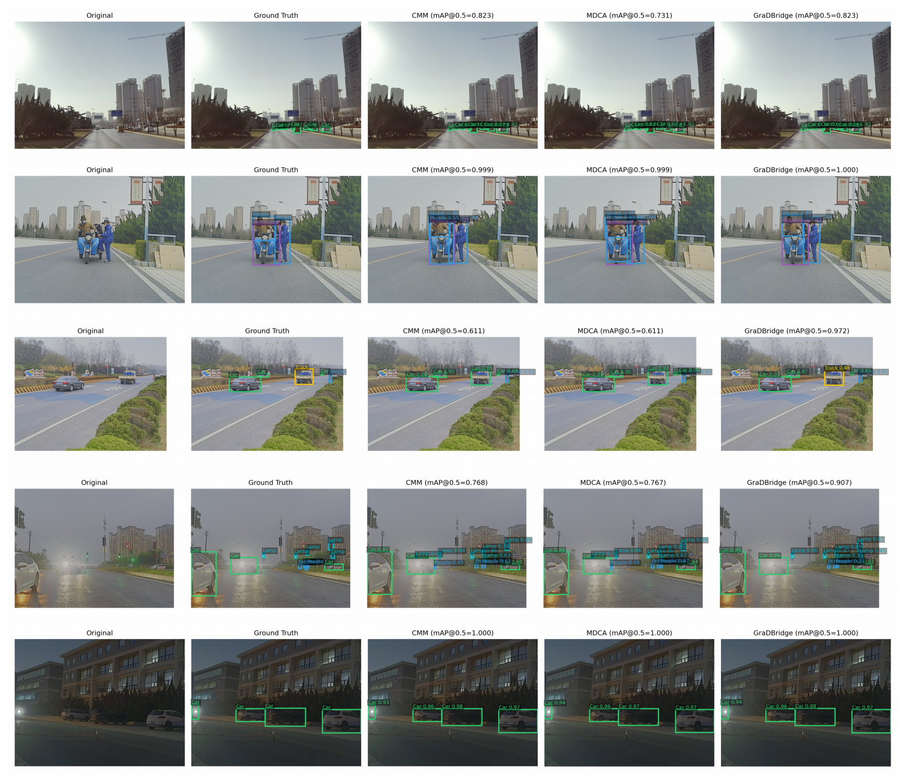

# GraDBridge on M3FD

Official implementation of **GraDBridge** on the **M3FD RGB-IR multispectral object detection dataset**.

This repository provides a **single-scale, single-fusion implementation of GraDBridge**, in which the GNSB module is applied once for RGB-IR feature fusion. It is intended as a compact and reproducible version for training and evaluating GraDBridge on M3FD.

## Overview

<p align="center">
  
</p>

<p align="center">
  Figure 1. Overview of the GraDBridge framework.
</p>

## GNSB Architecture

<p align="center">
  
</p>

<p align="center">
  Figure 2. Detailed architecture of the fusion module used in the single-scale, single-fusion configuration.</em>
</p>

## Visualization

<p align="center">
  
</p>

<p align="center">
  Figure 3. Qualitative detection results of GraDBridge on the M3FD dataset.
</p>

## Repository Structure

```text
GraDBridge/
├── configs/
│   └── hyp.scratch.yaml
├── data/
│   └── m3ddata.yaml
├── models/
│   ├── component/
│   │   └── GNSBOperatorBiasing.py
│   └── config/
│       └── GNSBOperatorBiasing_SingleFusion.yaml
├── train.py
├── test.py
└── train_m3fd.sh
```

## Dataset

Configure the M3FD dataset paths and class information in:

```text
data/m3ddata.yaml
```

The configuration should contain:

```yaml
train_rgb:
val_rgb:
train_ir:
val_ir:
nc:
names:
```

The M3FD dataset itself is not included in this repository. Please specify the corresponding RGB and IR training/validation paths in `data/m3ddata.yaml`.

## Installation

Install the required dependencies with:

```bash
pip install -r requirements.txt
```

## Training

Training can be started directly with:

```bash
bash train_m3fd.sh
```

Alternatively, run the full command:

```bash
python train.py \
  --data data/m3ddata.yaml \
  --hyp configs/hyp.scratch.yaml \
  --cfg models/config/GNSBOperatorBiasing_SingleFusion.yaml \
  --weights yolov5l.pt \
  --batch-size 8 \
  --epochs 200 \
  --device 1
```
